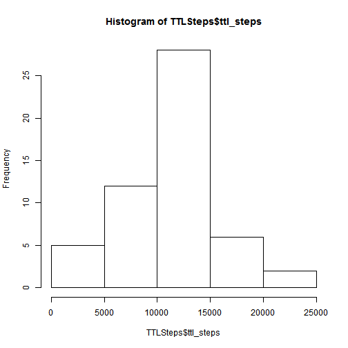

## Loading and preprocessing the data

```r
library(dplyr)
library(ggplot2)
activity<-read.csv("C:/Code/Coursera_DS/05-REP/repdata-data-activity/activity.csv")
activity$date<-as.Date(activity$date)
str(activity)
```

```
## 'data.frame':	17568 obs. of  3 variables:
##  $ steps   : int  NA NA NA NA NA NA NA NA NA NA ...
##  $ date    : Date, format: "2012-10-01" "2012-10-01" ...
##  $ interval: int  0 5 10 15 20 25 30 35 40 45 ...
```


## What is mean total number of steps taken per day?
#### 1. Calculate the total number of steps taken per day

```r
TTLSteps<-activity %>% group_by(date) %>% summarise(ttl_steps=sum(steps))
TTLSteps$ttl_steps<-as.numeric(TTLSteps$ttl_steps)
TTLSteps
```

```
## Source: local data frame [61 x 2]
## 
##          date ttl_steps
## 1  2012-10-01        NA
## 2  2012-10-02       126
## 3  2012-10-03     11352
## 4  2012-10-04     12116
## 5  2012-10-05     13294
## 6  2012-10-06     15420
## 7  2012-10-07     11015
## 8  2012-10-08        NA
## 9  2012-10-09     12811
## 10 2012-10-10      9900
## ..        ...       ...
```

#### 2. Plotting a histogram 

```r
hist(TTLSteps$ttl_steps)
```

 

#### 3. Calculate the mean and median of the total number of steps taken per day

```r
mean(TTLSteps$ttl_steps,na.rm = TRUE)
```

```
## [1] 10766.19
```

```r
median(TTLSteps$ttl_steps,na.rm = TRUE)
```

```
## [1] 10765
```


## What is the average daily activity pattern
#### 1. Make a time series plot of the 5-minute interval (x-axis) and the average number of steps taken, averaged across all days (y-axis)

```r
AVGSteps<- activity %>% group_by(interval) %>% 
    summarise(avg_step = mean(steps, na.rm=TRUE))
ggplot(AVGSteps,aes(x=interval, y=avg_step)) + geom_line()
```

 

#### 2. Which 5-minute interval, on average across all the days in the dataset, contains the maximum number of steps?

```r
index<-with(AVGSteps, which(avg_step == max(avg_step)))
AVGSteps$interval[index]
```

```
## [1] 835
```


## Imputing missing values
#### 1. Calculate and report the total number of missing values in the dataset

```r
sum(is.na(activity))
```

```
## [1] 2304
```


#### 2. filling all missing values

```r
na<-activity[is.na(activity),]
na<-merge(na,AVGSteps,by="interval")
na<-na[,-2]
names(na)[3]<-"steps"
head(na)
```

```
##   interval       date    steps
## 1        0 2012-10-01 1.716981
## 2        0 2012-11-30 1.716981
## 3        0 2012-11-04 1.716981
## 4        0 2012-11-09 1.716981
## 5        0 2012-11-14 1.716981
## 6        0 2012-11-10 1.716981
```

#### 3. Create a new dataset that is equal to the original dataset but with the missing data filled in.

```r
nona<-activity[complete.cases(activity),]
complete_data<-rbind(nona,na)
sum(is.na(complete_data))
```

```
## [1] 0
```

#### 4. Make a histogram of the total number of steps taken each day and Calculate and report the mean and median total number of steps taken per day. Do these values differ from the estimates from the first part of the assignment? What is the impact of imputing missing data on the estimates of the total daily number of steps?

```r
TTLSteps_all<-complete_data %>% group_by(date) %>% summarise(ttl_steps = sum(steps))
hist(TTLSteps_all$ttl_steps) 
```

 

```r
mean(TTLSteps_all$ttl_steps)
```

```
## [1] 10766.19
```

```r
median(TTLSteps_all$ttl_steps)
```

```
## [1] 10766.19
```


## Are there differences in activity patterns between weekdays and weekends?
#### 1. Create a new factor variable in the dataset with two levels – “weekday” and “weekend” indicating whether a given date is a weekday or weekend day.

```r
complete_data$wkdays<-weekdays(complete_data$date,TRUE)
complete_data$wkdays<-with(complete_data, ifelse(wkdays=="Sat"| wkdays=="Sun","weekend","weekday"))
head(complete_data)
```

```
##     steps       date interval  wkdays
## 289     0 2012-10-02        0 weekday
## 290     0 2012-10-02        5 weekday
## 291     0 2012-10-02       10 weekday
## 292     0 2012-10-02       15 weekday
## 293     0 2012-10-02       20 weekday
## 294     0 2012-10-02       25 weekday
```

#### 2. Make a panel plot containing a time series plot (i.e. type = "l") of the 5-minute interval (x-axis) and the average number of steps taken, averaged across all weekday days or weekend days (y-axis). See the README file in the GitHub repository to see an example of what this plot should look like using simulated data.

```r
avg_wd<-complete_data %>% filter(wkdays=="weekday") %>% 
    group_by(interval) %>% summarise(avgsteps=mean(steps))

avg_wkend<-complete_data %>% filter(wkdays=="weekend") %>% 
    group_by(interval) %>% summarise(avgsteps=mean(steps))

par(mfrow=c(2,1)) 
with(avg_wkend, plot(x=interval, y=avgsteps, type = "l")+title("AVG_Steps_Weekend"))
```

```
## numeric(0)
```

```r
with(avg_wd, plot(x=interval, y=avgsteps, type = "l")+title("AVG_Steps_Weekday")) 
```

 

```
## numeric(0)
```
